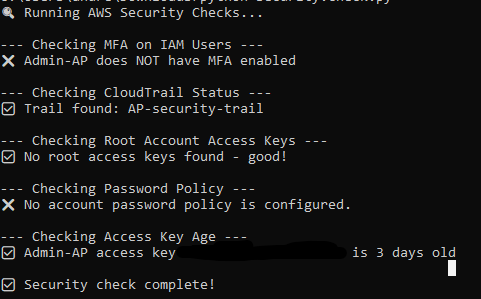

# AWS Security Baseline Lab

A beginner-friendly AWS security hardening project that sets up foundational 
security controls and automates misconfiguration checks using Python (boto3).

This project is part of my AppSec/Security Engineering/Automation learning path.

---

## Purpose

This lab demonstrates how to secure an AWS account from scratch and use Python 
to automate basic security checks — a core skill for Security Engineers and 
AppSec roles.

---

## Prerequisites

### AWS Setup
- AWS account (free tier)
- Root account secured with MFA
- IAM admin user created
- IAM user secured with MFA
- CloudTrail enabled with an S3 bucket for log storage and CloudWatch Logs enabled

### Local Machine Setup
- Python 3.x installed
- boto3 installed:
```cmd
pip install boto3
```
- AWS CLI installed and configured:
```cmd
aws configure
```
> You will need an IAM Access Key and Secret Access Key from your IAM user.
> **Never commit these to GitHub.**

- Verify your connection:
```cmd
aws sts get-caller-identity
```
You should see your Account ID and IAM user ARN returned.

---

## Security Controls Implemented

| Control | Status |
|--------|--------|
| Root account MFA | ✅ |
| IAM admin user created | ✅ |
| IAM user MFA | ✅ |
| CloudTrail enabled | ✅ |
| No root access keys | ✅ |
| Secure Password Policy | ✅ |
| 90 day Access Key Age Policy | ✅ |
| S3 Bucket Access Policy | ✅ |

---

##  Security Check Script

`security_check.py` — A Python script that automatically checks your AWS 
account for common misconfigurations:

- IAM users missing MFA
- CloudTrail status
- Root account access keys
- Access Key Age
- Password Policy
- S3 Bucket Public Access

### Run it:
```cmd
python security_check.py
```


